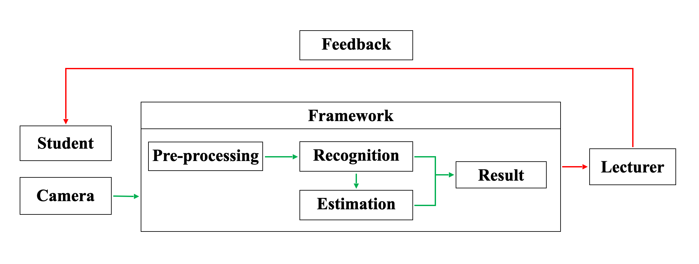

# Deep Learning on Human Concentration 

## Overview

figure 1. project overview

### Contributors
* [WoodoLee](https://github.com/WoodoLee)
* [lawkelvin33](https://github.com/lawkelvin33)
* [noparkee](https://github.com/noparkee)
* [ujos89](https://github.com/ujos89)

## Flow

### Step0. Environment Setting
ubuntu 20.04
gpu: GTX 1060 6GB
- main environment 
    - conda       4.8.3
    - python      3.6.12
- harness gpu
    - cuda        10.0
    - cudnn       7.6.5
    - tensorflow  1.15
    - keras       2.3.1
- visualization
    - matplotlib  3.3.1
    - seaborn     0.11.1
- process data
    - pandas      1.1.1
    - sklearn     0.23.2


### Step1. Video data to Pickle (video2pickle.py)
```sh
$ python3 video2pickle.py --video [video_name] --savefile [file_name_to_save]
```
We used [ildoonet/tf-pose-estimation](https://github.com/ildoonet/tf-pose-estimation.git) to extract each body part informations
save informations to pickle 


### Step2. Data Preprocessing (preprocessing.py)
```sh
$ python3 preprocessing.py --rawroot [raw_file_name]
```
In preprocessing.py...
- For each column of raw pickle data, drop missing data, and apply min-max normalize.
- Some body parts are concatenated to create a top and mid-data frame.
- top: Nos, Lea, Ley, Rea, Rey
- mid: Nec, Lel, Lsh, Rel, Rsh
- Calculate the variations of the top and mid part per every 100 frames and add labels.


### Step3. Merge prepared dataset & Shuffle
```sh
$ python3 build_trainset.py --name [person_initial] --index [index_number] 
```
merge dataset and shuffle to prevent biased labeled value


### Step4. Training DNN
```sh
$ python3 run_dnn.py --file [name of pickle] --plot [graph_idx] --size [dataset_size] --epoch [number of epoch] 
```
- 1st layer: dimension:11, activation: relu
- 2nd layer: dimension:32, activation: relu
- 3rd layer: dimension:1, activation: sigmoid


### Step5. Analysis
compared between size of data
